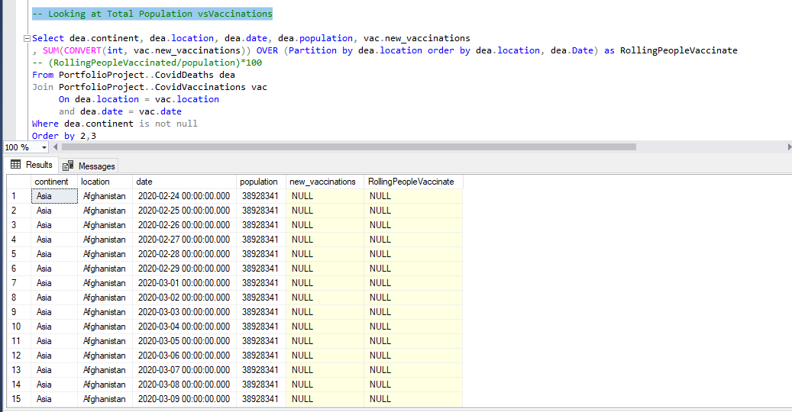
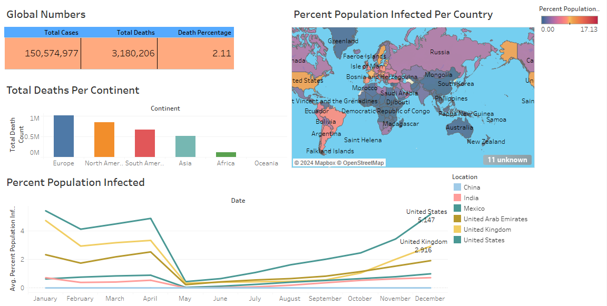

# Covid_Data_Analysis

This SQL project analyzes COVID-19 data focusing on deaths and vaccinations.

## Overview
This README provides a detailed explanation of the SQL queries used for the Tableau project, focusing on analyzing COVID-19 data. These queries retrieve and process data from the PortfolioProject database to derive meaningful insights for visualization in Tableau dashboards.

### Data Source
The data for this project was sourced from an Excel file containing information on COVID-19 cases, deaths, vaccinations, population, and continent details. The Excel file was obtained from a reliable source such as the World Health Organization (WHO) or the Centers for Disease Control and Prevention (CDC).

[DEATHS](https://github.com/SiriSrinivas6/Covid_Data_Analysis/blob/f760736f09d10666779125b8d019bedf60b61645/CovidDeaths.xlsx)
[VACCINATIONS](https://github.com/SiriSrinivas6/Covid_Data_Analysis/blob/a027c56baa96aaa0ad1c0dd5cb91d9208de46f0e/CovidVaccinations.xlsx)

## Queries

### Query Set 1:
1. **Total Cases and Deaths**: This query calculates the total number of COVID-19 cases, total deaths, and the death percentage globally. It provides an overview of the severity of the pandemic.
   
2. **Total Death Count by Location**: This query retrieves the total death count for each location, excluding specific entities like 'World', 'European Union', and 'International'. It helps in understanding the impact of COVID-19 on different regions.
   
3. **Infection Rate by Location**: This query determines the highest infection count and infection percentage by location. It identifies regions with the highest spread of the virus relative to their population, aiding in understanding the severity of the outbreak.
   
4. **Infection Rate by Location and Date**: This query identifies the highest infection count and infection percentage by location and date. It provides insights into the temporal trends of COVID-19 infections in different regions.

### Query Set 2:
1. **Rolling People Vaccinated**: This query calculates the rolling number of people vaccinated over time by location. It considers the cumulative sum of new vaccinations to track the progress of vaccination campaigns in various regions.
   
2. **Percentage of Population Vaccinated**: This query computes the percentage of the population vaccinated over time by location. It utilizes the rolling number of people vaccinated to assess the vaccination coverage and its impact on controlling the spread of COVID-19.

## Usage
1. **Executing Queries**: Run the provided SQL queries in SQL Server Management Studio or any compatible tool connected to the PortfolioProject database.
   
2. **Data Analysis**: Analyze the query results to understand COVID-19 trends and patterns. Examine the data to identify key insights relevant to the Tableau dashboard.
   
3. **Integration with Tableau**: Utilize the obtained data in Tableau to create visualizations for the dashboard. Design interactive charts and graphs to present the analyzed COVID-19 data effectively.

## Contributors
- Siri S

